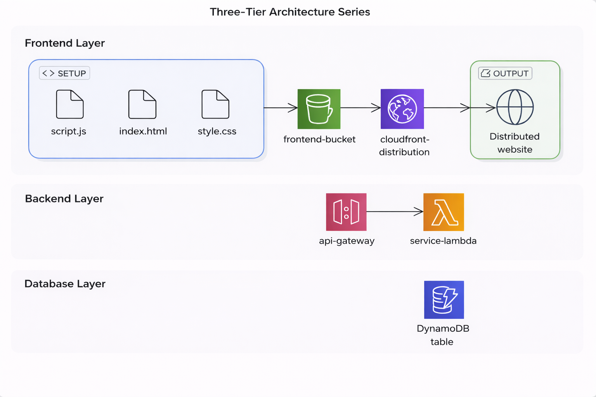
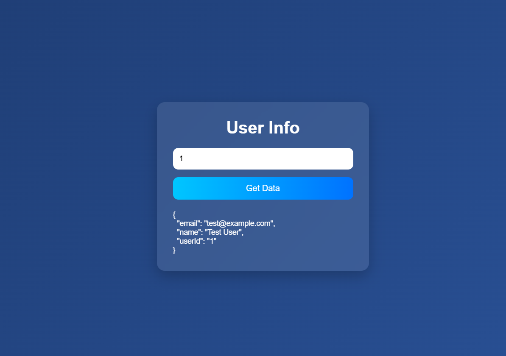

# 🚀 Serverless Three-Tier Web Application on AWS

## 📖 Overview
This project is a fully serverless three-tier web application built using AWS services.  
It demonstrates how to design and deploy a scalable, cost-efficient web application without managing servers.

---

## 🏗 Architecture
The application follows a three-tier architecture:

- **Frontend Tier**: Static website hosted on Amazon S3 and delivered via CloudFront  
- **Backend Tier**: API managed by API Gateway and processed using AWS Lambda  
- **Database Tier**: NoSQL database using DynamoDB  

---

## 🔁 Architecture Flow

1. User accesses the web application via CloudFront  
2. Frontend sends a request using Fetch API  
3. API Gateway receives the request  
4. Lambda function processes the request  
5. Data is retrieved from DynamoDB  
6. Response is returned to the frontend  

---

## ⚙️ Technologies Used

- Amazon S3 – Static website hosting  
- Amazon CloudFront – Content Delivery Network (CDN)  
- Amazon API Gateway – API management  
- AWS Lambda – Serverless compute  
- Amazon DynamoDB – NoSQL database  

---

## 🖼 Architecture Diagram

---

## 🖼 Application Screenshots

---

## 🚀 Features

- Fully serverless architecture  
- Scalable and highly available  
- Cost-efficient (pay-as-you-go model)  
- Fast content delivery using CDN  
- RESTful API integration  

---

## 🧠 What I Learned

- Designing serverless architectures  
- Integrating frontend with backend APIs  
- Working with AWS services (S3, CloudFront, API Gateway, Lambda, DynamoDB)  
- Handling CORS and debugging API issues  
- Managing IAM roles and permissions  

---

## 🤔 Why Serverless?

Serverless architecture was chosen because:

- No server management required  
- Automatic scaling  
- Cost-efficient for small to medium applications  
- Faster development and deployment  

---

## ⚠️ Notes

- No sensitive data or credentials are included in this repository  
- IAM roles and permissions were configured securely  

---

## 📌 Future Improvements

- Add authentication using AWS Cognito  
- Implement CI/CD pipeline (GitHub Actions)  
- Improve UI/UX design  
- Add monitoring and logging enhancements  

---

## 👨‍💻 Author

Developed by **Mohammad Al-Samada**
